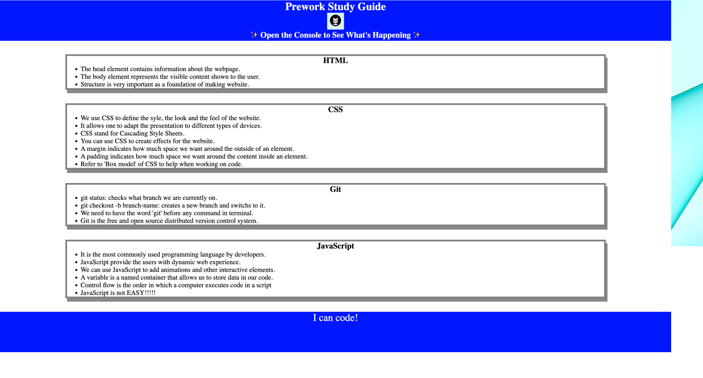
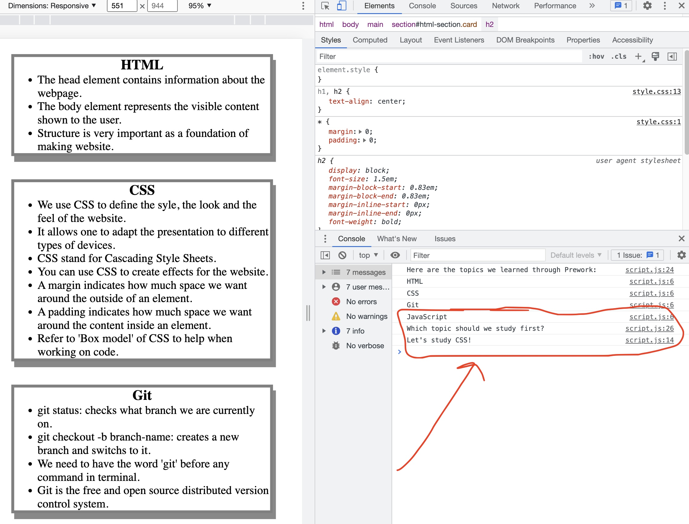

# Prework Study Guide

## Description

We all have different style and pace for learning new things. It can be very hard to absorb information in a short amount of time. This project is created to help bootcamp students keep track of their notes that they have learned during the pre-course. Students can refer to their notes on the Prework Study Guide when they stuck or simply just to refresh the memory. 

## Table of Contents 

## Installation

None.

## Usage
To use this Study Guide, you can review the notes in each section. For suggestions on what to study first, open the Chrom DevTools by pressing Command+Option(or Alt)+I (MacOS), Control+Shift+I (Windwos) or by using right click and select "Inspect" on the browser. The console panel should open either below or to the side of the webpage in the browser. There you will see a list of topics we learned from Prework along with a suggestion on which topic to study first.

## Credits

University of North Carolina at Charlotte 

## License

Please refer to the LICENSE in the repo.

